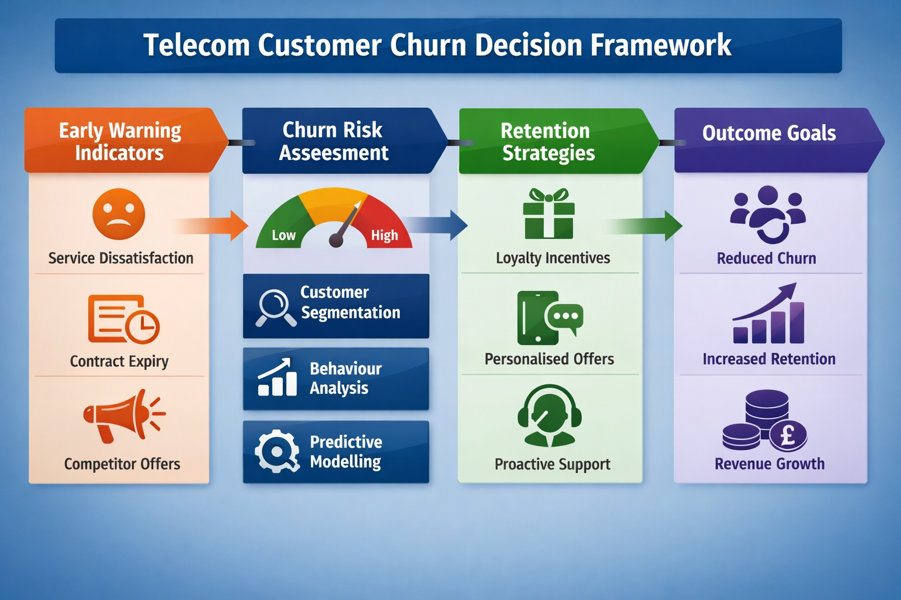

# UK Telecom Customer Switching Intelligence

## Project Overview

This project analyses customer switching behaviour within the UK telecommunications market using publicly available regulatory data from Ofcom.

The objective is to understand the drivers behind telecom provider switching and to develop structured decision-support insights for telecom customer retention strategy.

Rather than focusing purely on descriptive statistics, the project demonstrates how market-level data can inform strategic retention frameworks for telecom providers operating in competitive environments.

## Data Source

The analysis is based on Ofcom’s Switching Tracker dataset, which collects survey data from UK consumers regarding telecom provider switching behaviour.

The dataset captures information related to:

- Customer switching activity
- Drivers behind switching decisions
- Customer perceptions of telecom services
- Competitive pressures in the UK telecom market

All data used in this project is publicly available.

## Analytical Approach

The analysis focuses on three key areas:

1. Switching Behaviour Analysis  
   Examining how frequently UK telecom customers change providers.

2. Switching Drivers Analysis  
   Identifying the primary reasons behind switching decisions.

3. Strategic Retention Framework  
   Translating analytical insights into structured telecom customer retention strategies.

## Key Insight

Although most customers remain with their telecom provider, a measurable proportion actively switch providers when influenced by pricing competition, service dissatisfaction, or alternative offers from competing providers.

Early identification of switching signals is therefore critical for telecom operators seeking to reduce churn risk.

## Business Insight

The findings suggest that telecom customer switching behaviour is not purely price-driven but often triggered by specific service experiences or competitive offers.

This indicates that telecom providers could benefit from predictive analytics frameworks that identify early churn signals based on customer behaviour patterns. 

By monitoring indicators such as service dissatisfaction, contract lifecycle stages, or exposure to competitor promotions, operators can implement targeted retention strategies before switching occurs.

The analysis highlights how data-driven decision intelligence can support proactive customer retention within competitive telecom markets.

## Strategic Value

The analysis demonstrates how publicly available market data can support decision intelligence frameworks for customer retention strategy within the UK telecommunications sector.

## Repository Structure

data/  
Contains the raw dataset used for analysis.

images/  
Stores visual outputs and charts generated during the analysis.

notebook/  
Contains the primary analysis notebook used to explore telecom switching behaviour.

README.md  
Project overview and documentation.

TECHNICAL_NOTES  
Additional analytical observations and implementation notes.

The project highlights how analytical insights can move beyond reporting toward actionable strategic recommendations.

## Strategic Industry Implications

The insights derived from the analysis highlight several strategic considerations for telecom operators operating in highly competitive markets.

Customer retention should be prioritised alongside acquisition strategies, as switching behaviour is often triggered by identifiable dissatisfaction signals rather than random customer movement.

Operators may benefit from monitoring behavioural indicators such as service complaints, contract renewal stages, and competitor exposure to identify customers at risk of switching.

By integrating behavioural analytics into retention strategy, telecom providers can proactively intervene before switching occurs, improving long-term customer value and reducing churn-related revenue loss.

## Decision Intelligence Perspective

Rather than treating switching data purely as descriptive market statistics, this project interprets telecom switching behaviour through a decision-support lens.

The analysis demonstrates how publicly available consumer behaviour data can be translated into structured decision signals for telecom operators.

This approach highlights how analytics can move beyond reporting to support operational decision-making, retention strategy development, and proactive customer engagement within subscription-based service industries.

## Transferability of the Framework

Although this analysis focuses on the UK telecommunications sector, the analytical approach developed in this project is applicable to other subscription-based industries.

Customer switching dynamics observed in telecom markets closely resemble behaviour patterns seen in sectors such as broadband services, digital platforms, financial services, and software-as-a-service (SaaS) businesses.

The framework demonstrated in this project illustrates how behavioural switching data can support decision-support systems aimed at improving customer retention, reducing churn risk, and strengthening long-term customer relationships.

## Future Analytical Extensions

This project focuses on exploratory analysis of telecom switching behaviour using publicly available survey data. However, several potential analytical extensions could further strengthen the insights derived from this dataset.

Future work may include:

• Predictive churn modelling to estimate switching probability for different customer profiles.

• Sentiment and service quality analysis to understand how customer experience indicators influence switching decisions.

• Contract lifecycle analysis to evaluate how switching behaviour changes near contract renewal periods.

• Competitive market analysis to explore how promotional activity and pricing structures influence switching dynamics.

These potential extensions demonstrate how telecom switching data could support more advanced analytics frameworks aimed at proactive churn prevention and long-term customer value optimisation.

## Telecom Churn Decision Framework

The following diagram illustrates how telecom switching insights can be translated into structured decision-support strategies for telecom operators.

